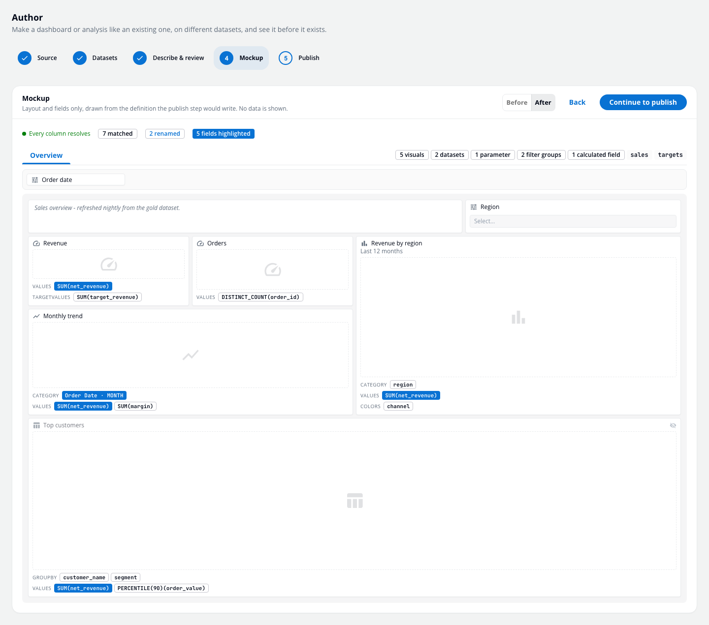
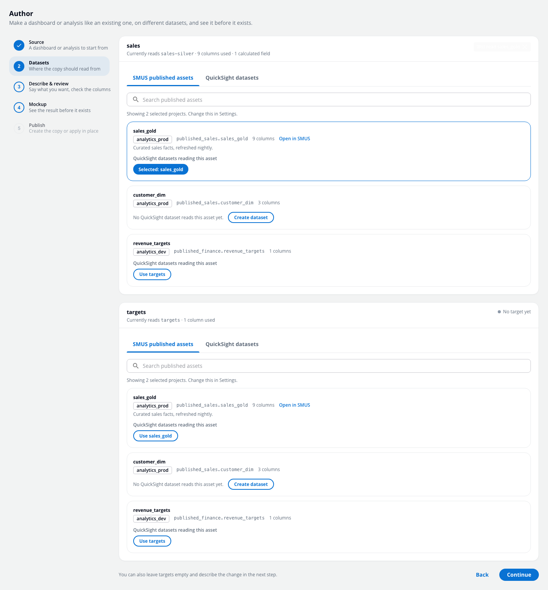
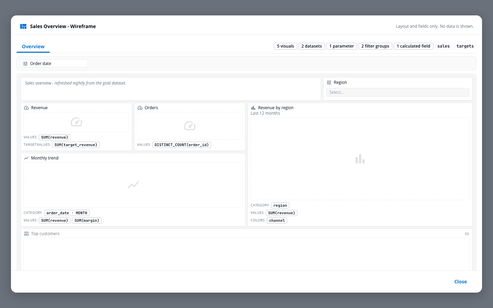
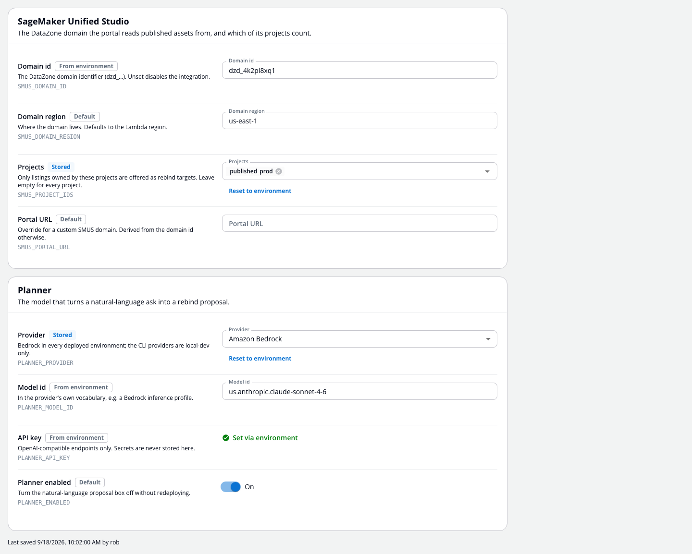
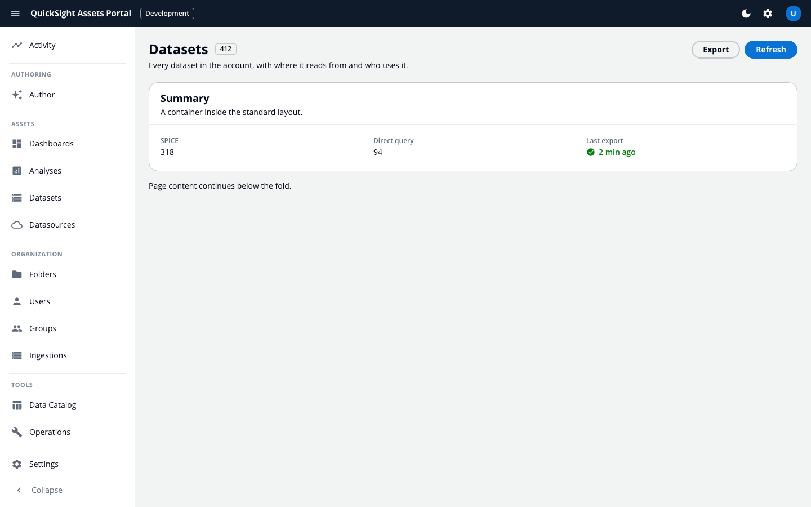

# QuickSight Assets Portal

[](https://github.com/yeahthisisrob/quicksight-portal/releases)
[](https://github.com/yeahthisisrob/quicksight-portal/actions/workflows/build.yml)
[](LICENSE)

A self-hosted portal for Amazon QuickSight that goes past inventory: it can **author**. Describe a change in plain language, watch a hybrid planner turn it into a validated plan, see the result as a wireframe before anything is written, then publish a copy or an in-place update. Underneath sits the full admin toolset: every dashboard, analysis, dataset, data source, folder, user and group in the account, with lineage, activity analytics, safe export and restore, and a growing SageMaker Unified Studio integration. Deploys into your own AWS account with one CDK command.



## Features

### Author: make one like this, on that dataset

The Author page is a five-step flow for the two asks every BI team gets: *"create a dashboard like this one but on the new dataset"* and *"convert this analysis to the gold layer"*.

1. **Source** - pick a dashboard or analysis. Assets tagged as templates sort first, and any asset can be marked as one from here.
2. **Datasets** - for each dataset the definition reads, choose what it should read instead: a **published SMUS asset** (with the QuickSight datasets that already read it, so nothing gets duplicated; or create one in place), or any QuickSight dataset.
3. **Describe & review** - type what you want, or fill the form by hand. Every referenced column is resolved against the target as matched, renamed, suggested or missing. Suggestions are never applied silently; a click turns one into a rename.
4. **Mockup** - a before/after wireframe of the result, drawn from the exact definition the publish step would write, with every renamed field highlighted. No data is rendered.
5. **Publish** - create the copy (keeping the source's theme and permissions) or apply in place (dashboards get a published version). QuickSight's own validation error, if any, is shown verbatim.



### The planner: a model proposes, code decides

The natural-language part is deliberately small. The model is asked two narrow questions, each answered as JSON against a flat schema:

- which candidate dataset each identifier should read from, and whether this is a copy or an in-place change;
- only if the server's dry run leaves columns unresolved, which target column each unresolved source column means.

Everything else is deterministic TypeScript: what the definition references, whether the target satisfies it, the rewrite itself. The planner's answer is validated, run through the same dry run the UI shows, and returned as a proposal. **Nothing is applied by the model.** A person, a CLI, or an agent reads the plan and calls apply.

The model interface is one call, prompt in and JSON out, which keeps it model-agnostic:

| Provider | Use |
|---|---|
| **Amazon Bedrock** (Converse API) | Production. Any Bedrock model with tool use; cross-region inference profiles by default. Your data never leaves your account. |
| Local **Claude** or **Codex** CLI | Development. The planner runs through your own logged-in CLI with no cloud credentials. Never used inside Lambda. |
| Any **OpenAI-compatible** endpoint | Grok, OpenAI, or a gateway, via `PLANNER_BASE_URL`. |

The provider and model are settings, not a redeploy.

### Wireframes

Any dashboard or analysis renders as a wireframe from its cached definition: sheets, every visual as a card in its real grid, free-form or paginated position, the visual type, its title, and its field wells. Close to QuickSight's look without pretending to be it, and never showing data. The same renderer draws the Author mockup.



### SageMaker Unified Studio

The portal reads the published catalog of a SMUS (DataZone) domain: each listing with its owning project, its Glue table and columns from the listing's metadata forms, and the QuickSight datasets already reading it. Settings choose which projects count and, optionally, a database-name pattern for the published layer. From a listing with no dataset yet, the portal can create one through an existing data source, copying permissions from a reference dataset so it has an audience. This is the direction the portal is heading: more of what you do here will start from what SMUS publishes.

### Settings

Configuration lives in DynamoDB with a fallback to the Lambda's environment variables, so a fresh deployment works from env alone and values move over one at a time. Every setting shows where its value comes from. Secrets stay in the environment.



### Asset management
- **Full inventory** of dashboards, analyses, datasets, data sources, folders, users, and groups with server-side search, sorting, and pagination
- **Change datasets** from any dashboard or analysis row, with the same plan-then-apply flow as Author
- **Edit dataset sources** in place: schema, table, custom SQL, data source
- **Smart Sync export engine** - incremental exports that only touch assets that changed in QuickSight; if the cache is lost it self-heals by re-parsing existing S3 exports with zero API calls
- **Resumable long runs** - exports checkpoint their progress and continue across Lambda invocations; only one export runs at a time (enforced by an atomic DynamoDB lock)
- **Operations** - export console, archived assets with restore, and maintenance scripts on one page
- **Bulk operations** - tag, folder-membership, and delete operations across selections, with per-item results
- **CSV export** of any asset listing

### Insight & governance
- **Data lineage** - dataset, data source and dashboard/analysis relationships, including composite datasets and transitive dependencies
- **Activity analytics** - CloudTrail-derived view counts and viewer history, dataset refresh history, per-user activity
- **Tags & permissions** - browse and edit tags, inspect asset permissions, filter any asset page by a user's access
- **Data catalog** - a field-level index across datasets and dashboards (early; the SMUS catalog is where this is going)



## Architecture

| Layer | Technology |
|---|---|
| Frontend | React + TypeScript + MUI on a token-based design system (Cloudscape-inspired, light and dark), organized by [Feature-Sliced Design](https://feature-sliced.design/), every component in Storybook |
| Planner | Amazon Bedrock (Converse, forced tool call for structured output) by default; local Claude/Codex CLI or any OpenAI-compatible endpoint behind the same one-call interface |
| Backend | Node.js 22 Lambda (TypeScript), organized by Vertical Slice Architecture |
| API | HTTP API (API Gateway v2) behind CloudFront (same-origin), contract-first via OpenAPI |
| Auth | Cognito user pool; JWT verified in-Lambda on every route; optional WAF + IP allowlist at the edge |
| Jobs | **DynamoDB** — per-job records, item-per-line logs, atomic heartbeats, TTL retention, conditional-write export lock; SQS + worker Lambda with a self-requeuing continuation pattern for long runs |
| Asset data | **S3** — exported asset definitions (source of truth), per-type caches with ETag-revalidated in-memory reads, pre-computed catalog/lineage/field indexes |
| Infrastructure | AWS CDK with [cdk-nag](https://github.com/cdklabs/cdk-nag) (AWS Solutions rules) enforced on every synth |

### How authoring works

1. `GET /api/authoring/{type}/{id}/datasets` reads the definition live and lists every column it takes from each dataset identifier (field wells, filters, parameters, controls, formatting, calculated-field expressions).
2. `POST .../rebind/plan` resolves those columns against the target dataset's output columns. Nothing is written.
3. `POST .../propose` is the planner: the ask plus the candidates in, a validated proposal plus the same plan out.
4. `POST .../rebind/preview` returns the rewritten definition for the mockup.
5. `POST .../rebind` re-plans, refuses unless every column resolves, then creates the copy or updates in place.

Every step is an ordinary authenticated API call, so the same flow is available to the UI, a script, or an agent.

### How an export works

1. The API creates a job record (DynamoDB) and enqueues a message (SQS) — the UI starts polling immediately.
2. The worker Lambda acquires the single-export lock, lists assets from QuickSight, and compares against the cache: changed assets are re-exported, assets exported under an older parser version are re-parsed locally (zero API calls), everything else is skipped.
3. Every log line, progress update, and checkpoint is an atomic DynamoDB write that doubles as a heartbeat — a dead worker is auto-failed within 30 minutes, never leaving a stuck job.
4. If the run approaches the Lambda time limit, it checkpoints and requeues itself; a fresh invocation resumes exactly where it stopped.
5. When all asset types finish, the derived caches (field catalog, lineage, list snapshots) rebuild once.

## Prerequisites

- [mise](https://mise.jdx.dev) - installs everything else (Node, pnpm, just,
  lefthook, gitleaks) at the versions pinned in `mise.toml`:
  `curl https://mise.run | sh`
- AWS account with QuickSight (Enterprise edition recommended for full API coverage)
- AWS CLI configured with credentials
- Docker Desktop *(only for local development with SAM Local)*

## Quick Start

1. **Clone and install**
   ```bash
   git clone https://github.com/yeahthisisrob/quicksight-portal.git
   cd quicksight-portal
   just install
   ```
   `just install` uses [mise](https://mise.jdx.dev) to fetch the exact Node,
   pnpm, lefthook and gitleaks versions pinned in `mise.toml`, installs the
   workspace with pnpm, and registers the git hooks. If you do not have mise
   or just yet: `curl https://mise.run | sh && mise install && mise exec -- just install`.

2. **Point at your AWS account**
   ```bash
   export CDK_DEFAULT_ACCOUNT=your-aws-account-id
   export CDK_DEFAULT_REGION=us-east-1
   # or: export AWS_PROFILE=your-profile-name
   ```

3. **Deploy**
   ```bash
   just synth              # review what will be created
   pnpm run cdk:bootstrap  # first time only
   just deploy             # checks, builds, then deploys the stack
   ```
   The stack creates CloudFront + S3 (SPA), the API and worker Lambdas, Cognito, the SQS export queue + DLQ, and the DynamoDB jobs table. Outputs include the **SiteURL** — the portal is live there.

   Optional context flags: `-c enableWaf=false` (WAF is on by default), `-c allowedIpRanges='["1.2.3.4/32"]'` (edge IP allowlist), `-c smusDomainId=dzd_xxxx` (SMUS integration), `-c nag=false` (skip cdk-nag for a one-off synth).

4. **Create your first user**
   ```bash
   aws cognito-idp admin-create-user \
     --user-pool-id <UserPoolId from CDK output> \
     --username you@example.com \
     --user-attributes Name=email,Value=you@example.com

   aws cognito-idp admin-add-user-to-group \
     --user-pool-id <UserPoolId from CDK output> \
     --username you@example.com \
     --group-name QuickSightUsers
   ```
   (Or use the Cognito console; add admins to the `Admins` group.)

5. **Run your first export** — sign in, open **Export Assets**, and start a **Smart Sync**. The portal populates itself from your QuickSight account.

## Development

Everything runs through [just](https://just.systems) (`just --list` for the full
set). Recipes go through `mise exec`, so the pinned toolchain is used whether or
not mise is activated in your shell.

```bash
just install      # one-time: toolchain, dependencies, git hooks
just dev          # SAM Local API (:3000) + Vite (:5173) + watchers
just check        # what CI runs: lint, typecheck, tests, architecture rules
just fix          # apply every safe formatting and lint fix
just storybook    # component workshop (:6006)
```

Before first run, copy the local config templates and fill in your account
details / CDK outputs:

```bash
cp frontend/public/config.js.example frontend/public/config.js
cp sam/template.yaml.example sam/template.yaml
cp sam/env.example.json sam/env.json
```

### Toolchain

| Concern | Tool | Config |
| --- | --- | --- |
| Tool versions | mise | `mise.toml`, `mise.lock` |
| Packages | pnpm workspace | `pnpm-workspace.yaml`, one `pnpm-lock.yaml` |
| Format + lint | Biome | `biome.jsonc` |
| Tasks | just | `justfile` |
| Git hooks | lefthook | `lefthook.yml` |
| Secrets | gitleaks | `.gitleaksignore` |

Biome replaced ESLint and Prettier: it formats and lints the whole repo in about
150ms, and it also enforces the architecture. The backend's Vertical Slice rules
(only the adapter layer may touch the QuickSight SDK) and the frontend's
Feature-Sliced rules (a layer may import only from layers below it, through their
public APIs) live in the `overrides` section of `biome.jsonc`.

A linter that silently stops matching still reports success, so
`scripts/verify-architecture-rules.mjs` writes deliberate violations at the real
paths those rules target and asserts each one is caught. It runs in `just check`
and in CI.

Use `pnpm`, never `npm` - a stray `npm install` creates a second lockfile and
reintroduces exactly the version drift the workspace removes.

Local development talks to your real AWS account (S3, DynamoDB, QuickSight); the jobs table is created automatically on first use if it doesn't exist.

## Project Structure

```
├── frontend/                 # React SPA (Feature-Sliced Design)
│   └── src/
│       ├── app/  pages/  widgets/  features/  entities/  shared/
├── backend/lambda/           # Lambda code (Vertical Slice Architecture)
│   ├── features/             # vertical slices (data-export, activity, data-catalog, ...)
│   ├── shared/               # cross-slice services (cache, jobs, aws, parsing, lineage)
│   ├── index.ts              # API Lambda entrypoint
│   └── worker.ts             # SQS worker Lambda entrypoint
├── infrastructure/cdk/       # CDK stack (+ cdk-nag)
├── shared/schemas/           # OpenAPI spec (source of truth for API types)
└── sam/                      # SAM Local templates for local development
```

## API

Contract-first via OpenAPI: `shared/schemas/api.openapi.yaml` defines every endpoint; frontend types are generated from it (`shared/generated/types.ts`). Highlights:

- `/api/authoring/*` - definition datasets, plan, preview, propose (planner), apply
- `/api/smus/assets` - published SMUS assets with their linked datasets; create a dataset from one
- `/api/settings` - stored settings with their sources; the SMUS project list
- `/api/assets`, `/api/export/{assetType}/{assetId}` — asset listings and raw definitions
- `/api/export`, `/api/jobs/*` — export jobs, status, logs, results, stop
- `/api/lineage`, `/api/catalog` — lineage graph and field catalog
- `/api/activity/*` — views, viewers, ingestion history
- `/api/folders`, `/api/users`, `/api/groups`, `/api/tags` — organization and governance

## Security

- Cognito authentication; JWTs verified in the API Lambda on every request
- CloudFront same-origin API routing; WAF (managed rules) on by default with optional IP allowlisting at the edge
- Least-privilege IAM scoped to the metadata bucket, jobs table, and QuickSight; encrypted S3/SQS/DynamoDB
- **cdk-nag (AWS Solutions pack) fails synth on unreviewed findings** — every accepted deviation is acknowledged in the stack with a written reason
- CloudTrail-based activity auditing surfaced in the portal
- The planner never writes to QuickSight: model output is validated as untrusted data and only reaches the apply step through the same plan a person reviews; Bedrock keeps prompts and definitions inside your account

## Troubleshooting

| Symptom | Check |
|---|---|
| Export stuck or slow | Job page shows worker heartbeat + per-type progress; a dead worker auto-fails within 30 min and the run can simply be restarted (Smart Sync resumes incrementally) |
| Empty portal after deploy | Run a Smart Sync export; check the worker Lambda's CloudWatch logs |
| Permission denied errors | Lambda execution role vs. QuickSight permissions; QuickSight must be active in the region |
| Cognito callback mismatch | The deployed config is wired automatically; for local dev, check `frontend/public/config.js` |

## Contributing

See [CONTRIBUTING.md](CONTRIBUTING.md). Releases are automated with release-please (conventional commits); CI runs lint, typecheck, tests, and builds on every PR, and Dependabot keeps dependencies current.

## License

MIT — see [LICENSE](LICENSE).
